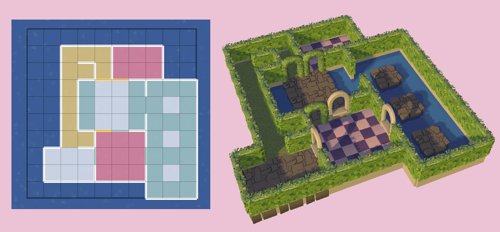

# Dungeon Designer

A work in progress tool for creating grid-based dungeon layouts in the style of games such as Grimrock, Undernauts, and the Etrian Odyssey series.

Maps are exported as .dun files (json files with a different file extension), and can be used to generate environments in your own projects. 

The project is in its very early stages right now and is being made to support a specific personal project, and as such, many expected features will be missing or in unfinished states.



*A screenshot of a map created in Dungeon Designer next a screenshot of the same map loaded into an example project in the Godot engine*


## Documentation

As the project will change throughout development, full documentation may come later.

Files can be loaded and saved with CTRL+L and CTRL+S respectively. The output file will be saved to ./levels/map1.dun. A more fleshed out save/load system may be added later.

You'll need to create your own functions to parse the generated .dun files in your own projects.

Currently, a user can switch between different walls and floors by pressing 1-4 before drawing.

### .dun file format

*Please note*: This format could change with future versions as more features need to be accounted for, but attempts may be made to maintain backwards compatibility for loading files within Dungeon Designer but this cannot be guaranteed.

Each tile has a floor, a northern wall and a western wall. Southern and eastern walls can be provided by the northern/western walls of adjacent tiles. For more detailed information please read [this post on Red Blob Games' website](https://www.redblobgames.com/grids/edges/#coordinates) which Dungeon Designer has taken inspiration from.

```json
{
    "(x_position, y_position)": {   // Json cannot handle tuples as keys, so it is converted to a string in the file
        "floor": 1,                 // Make sure to convert it back when loading into your project.
        "nwall": 1, 
        "wwall": 1
    }
}
```

## Planned improvements

Please note: The project is a work-in-progress intended for personal use and some of these features may not be completed.

- Improved save/load system
- A palette in the UI for different wall/floor types. 
- A way to place props within tiles
- Multi-floor editing with onion skinning.


## Resource Attribution

Third party resources used:

<a href="https://www.flaticon.com/free-icons/drag" title="drag icons">Drag icon created by Pixel perfect - Flaticon</a>